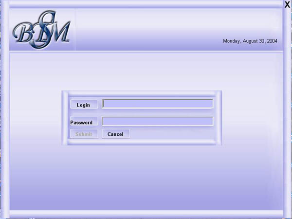

## Banks Transactions Management System

### Description

Do you want to make a WIZARD-LIKE application? see this appliaction. i like to work on GUI more than programming.

its for my dad, he makes alot of transactions in banks. and he needed something that can help him do that. Manage bank accounts' balances and transactions. I included this prog here because i really used a very complicated GUI, the easiest way to use by users. its like the wizard of windows with backs and nexts you know. there's alot of good tricks there. Now, i am not after any votes or anything I just wouls lke you to tell me what do you think because its my first program in VB. NOTE: tell me if you see a missing file or dll or anything. :) because i devloped this prog 3 months ago. i copied some codes from the internet also.Username & password are guest:guest or Admin:Admin
 
### More Info
 

             |
---                |---
**Submitted On**   |2004-01-20 19:23:22
**By**             |[DMS\-YAM](https://github.com/Planet-Source-Code/PSCIndex/blob/master/ByAuthor/dms-yam.md)
**Level**          |Intermediate
**User Rating**    |4.0 (8 globes from 2 users)
**Compatibility**  |VB 6\.0
**Category**       |[Complete Applications](https://github.com/Planet-Source-Code/PSCIndex/blob/master/ByCategory/complete-applications__1-27.md)
**World**          |[Visual Basic](https://github.com/Planet-Source-Code/PSCIndex/blob/master/ByWorld/visual-basic.md)
**Archive File**   |[Banks\_Tran1792759122004\.zip](https://github.com/Planet-Source-Code/dms-yam-banks-transactions-management-system__1-55904/archive/master.zip)

